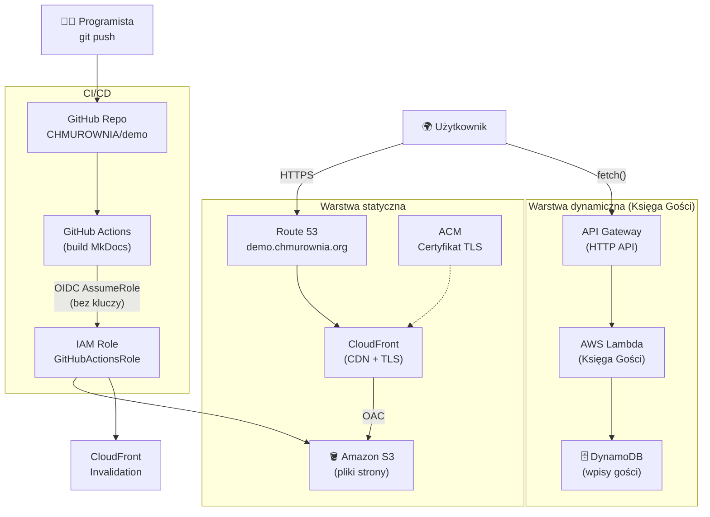

# Chmurownia — Demo 🚀

Witaj! To jest **przykładowy efekt warsztatów** *"Praktyczne wprowadzenie do chmury AWS i pracy zespołowej w IT"*.

Cała ta strona jest zbudowana w **MkDocs**, przechowywana na **Amazon S3**, serwowana przez **CloudFront** (HTTPS + własna domena), a **Księga Gości** działa na żywo dzięki **API Gateway**, **AWS Lambda** i **DynamoDB**.

Co najważniejsze — **nie klikałem niczego ręcznie w konsoli AWS**. Cała infrastruktura powstała z kodu (**Terraform**), a publikacja odbywa się automatycznie przez **GitHub Actions** (CI/CD) z uwierzytelnieniem **OIDC** (bez kluczy dostępowych).

## Co uczniowie zbudują na warsztatach

- [x] Statyczną stronę WWW (wizytówkę zespołu)
- [x] Hosting na Amazon S3 + dystrybucja przez CloudFront
- [x] Certyfikat HTTPS (ACM) i własną domenę (Route 53)
- [x] Automatyczne wdrożenia z GitHub Actions (OIDC, bez kluczy)
- [x] Dynamiczną Księgę Gości (API Gateway + Lambda + DynamoDB)

## Architektura rozwiązania

Poniższy diagram pokazuje, jak połączone są wszystkie elementy tego demo.

## Użyte usługi AWS

| Usługa | Rola w projekcie |
|---|---|
| **Amazon S3** | Przechowuje pliki wygenerowanej strony |
| **Amazon CloudFront** | CDN + HTTPS, serwuje stronę użytkownikom |
| **AWS Certificate Manager** | Certyfikat TLS dla `demo.chmurownia.org` |
| **Amazon Route 53** | Rekord DNS wskazujący na CloudFront |
| **Amazon API Gateway** | Publiczne API Księgi Gości |
| **AWS Lambda** | Logika zapisu/odczytu wpisów |
| **Amazon DynamoDB** | Baza danych wpisów |
| **AWS IAM + OIDC** | Bezpieczne wdrożenia z GitHub Actions |

!!! tip "Dla nauczycieli"
    Każdy zespół uczniowski przechodzi dokładnie tę samą ścieżkę — od pustego repozytorium do w pełni działającej, automatycznie wdrażanej aplikacji w chmurze.
